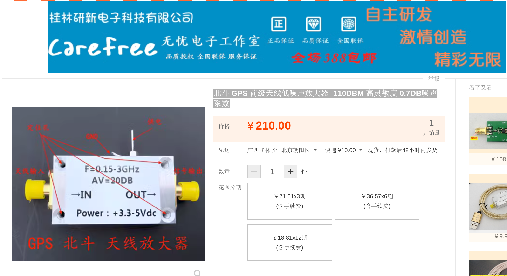
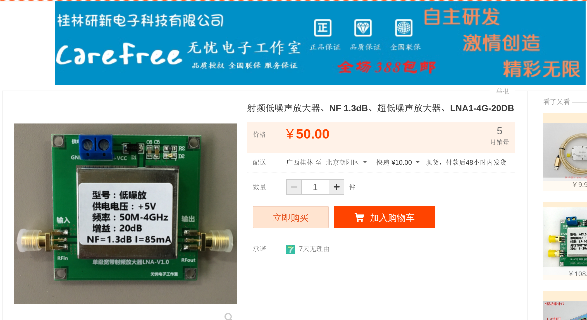
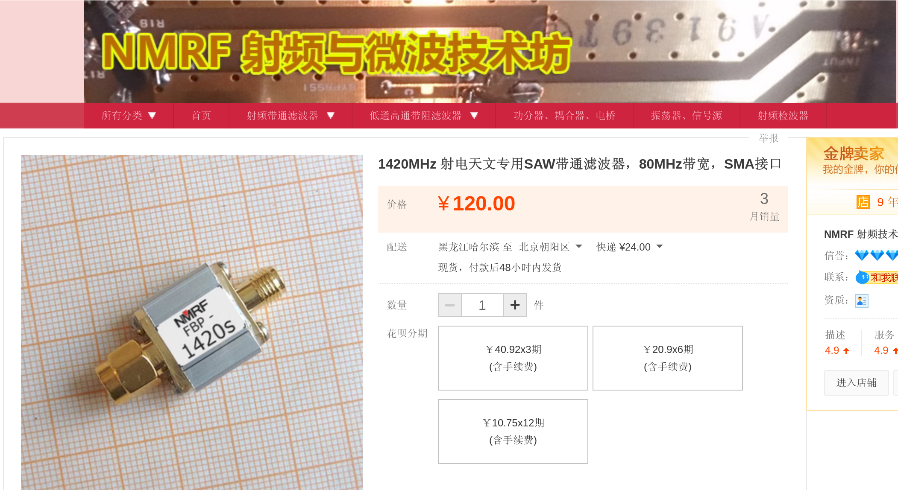

# LNA
购买链接：
[北斗 GPS 前级天线低噪声放大器 -110DBM 高灵敏度 0.7DB噪声系数 ](https://item.taobao.com/item.htm?spm=a1z09.2.0.0.67002e8dMmKR5j&id=571082349565&_u=bgtea893ae)

数量：1

# 次级放大器
购买链接：
[射频低噪声放大器、NF 1.3dB、超低噪声放大器、LNA1-4G-20DB](https://item.taobao.com/item.htm?spm=a1z09.2.0.0.67002e8dMmKR5j&id=526259089395&_u=bgtea8f9fb)

数量：2

# 滤波器（选项1）
购买链接：
[1420MHz 射电天文专用SAW带通滤波器，80MHz带宽，SMA接口 ](https://item.taobao.com/item.htm?spm=a1z09.2.0.0.67002e8dMmKR5j&id=634788966537&_u=bgtea8108c)

数量：1

# 铝壳
购买链接
[铝壳铝型材壳体铝盒铝合金外壳定制电子diy电路板盒电源盒 55*159](https://item.taobao.com/item.htm?spm=a1z09.2.0.0.67002e8d5E2lmE&id=544920872411&_u=bgtea8e632)

数量：1
